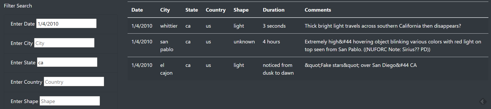

# UFOs

## Overview of the Project

In this project, I added new filters to the UFO sightings table, allowing users to search by multiple criteria. In addition to the date filter, I added filters for city, state, country, and shape.  

## Results

The additional filters make for a much more dynamic and responsive app. Users can search the UFO sightings table by entering search terms into any of the filters. For example, the following search retrieves all results for California on 1/4/2010.

Filters can be cleared by removing the input from the search field.

## Summary

The additional filters improve the functionality of the site, but the search fields are somewhat unwieldy. Text needs to be manually cleared from a field in order to reset the filter. The top navbar resets all filters and returns users to the full table, but its function is not intuitive and it is not conveniently placed. 

#### Recommendations for further development

- Adding buttons to clear the individual filters and a button to clear all filters would make it much easier for users to perform successive searches. 
- Making the table columns sortable would further help users to customize their search results.

